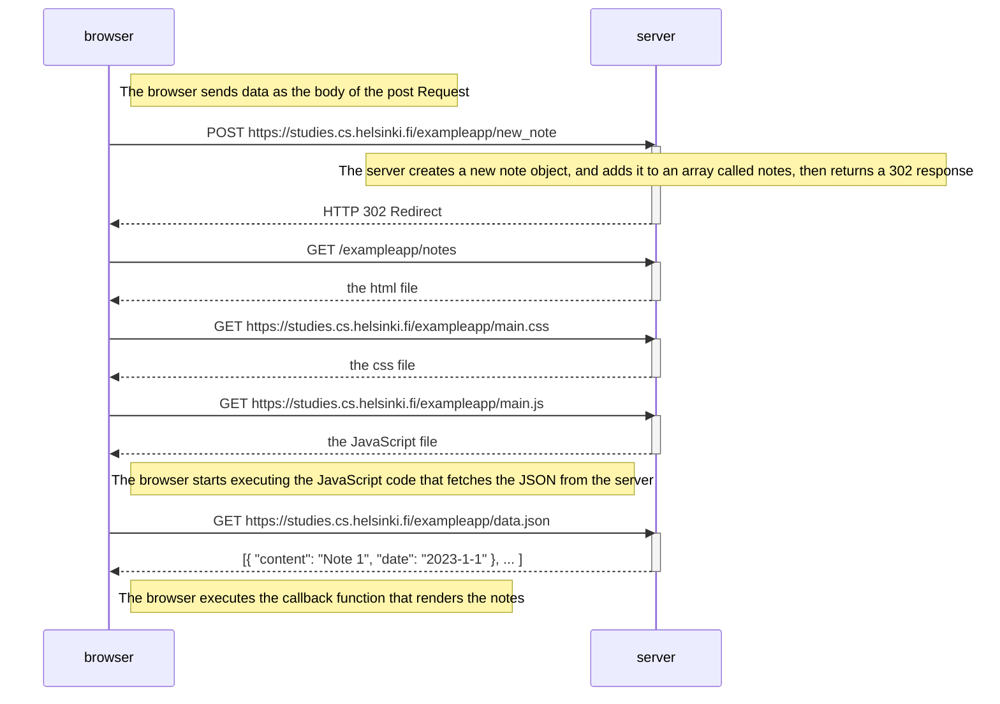

```mermaid
sequenceDiagram
    participant browser
    participant server

        Note right of browser: The browser sends data as the body of the post Request
    browser->>server: POST https://studies.cs.helsinki.fi/exampleapp/new_note      
    activate server
        Note over server: The server creates a new note object, and adds it to an array called notes, then returns a 302 response
    server-->>browser: HTTP 302 Redirect
    deactivate server

    browser->>server: GET /exampleapp/notes
    activate server
    server-->>browser: the html file
    deactivate server
    
    browser->>server: GET https://studies.cs.helsinki.fi/exampleapp/main.css
    activate server
    server-->>browser: the css file
    deactivate server

    browser->>server: GET https://studies.cs.helsinki.fi/exampleapp/main.js
    activate server
    server-->>browser: the JavaScript file
    deactivate server

    Note right of browser: The browser starts executing the JavaScript code that fetches the JSON from the server

    browser->>server: GET https://studies.cs.helsinki.fi/exampleapp/data.json
    activate server
    server-->>browser: [{ "content": "Note 1", "date": "2023-1-1" }, ... ]
    deactivate server

    Note right of browser: The browser executes the callback function that renders the notes
```