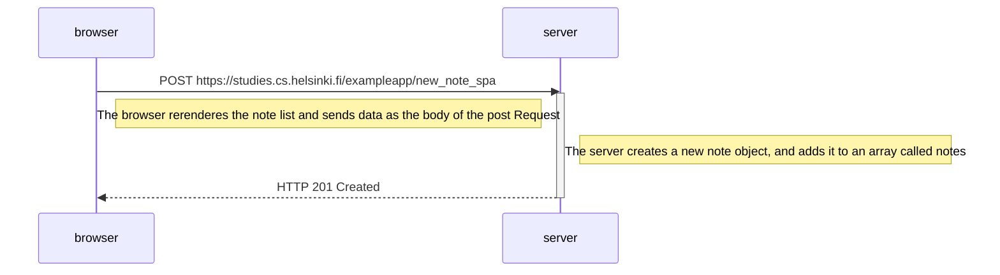

```mermaid
sequenceDiagram
    participant browser
    participant server

    browser->>server: POST https://studies.cs.helsinki.fi/exampleapp/new_note_spa       
    activate server
        Note right of browser: The browser rerenderes the note list and sends data as the body of the post Request
        Note right of server: The server creates a new note object, and adds it to an array called notes
    server-->>browser: HTTP 201 Created
    deactivate server
```
